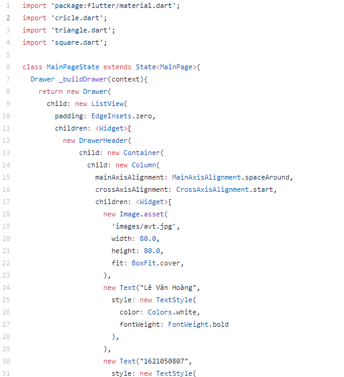
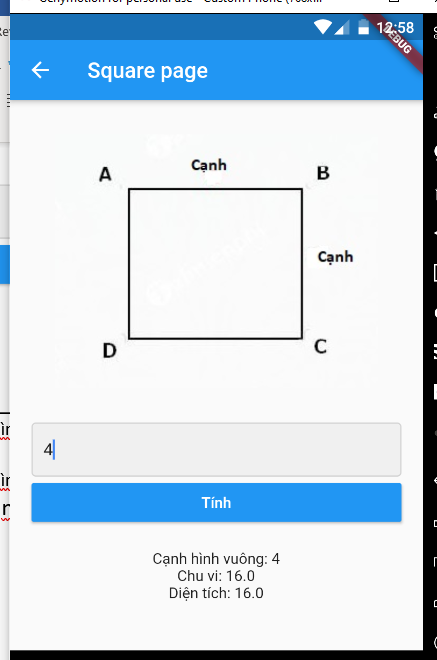

Bài thu hoạch của sinh viên
===========================
## Đầu tiên chúng ta sẽ cần tìm hiểu Flutter là gì?
### Flutter là gì?
> Flutter là UI Framework mã nguồn mở dành cho di động, miễn phí được tạo bởi Google và phát hành vào tháng 5 năm 2017.
Nói đơn giản, Flutter nó cho phép bạn tạo một ứng dụng di động gốc (native app) với một codebase.
Điều này có nghĩa là bạn có thể sử dụng một ngôn ngữ lập trình và một codebase để tạo hai ứng dụng khác nhau (cho iOS và Android).
Flutter gồm 2 thành phần quan trọng:
* Một SDK (Software Development Kit): Một bộ sưu tập các công cụ sẽ giúp bạn phát triển các ứng dụng của mình. Điều này bao gồm các công cụ để biên dịch mã của bạn thành mã máy gốc (mã cho iOS và Android).
* Một Framework (UI Library based on widgets): Một tập hợp các thành phần UI có thể tái sử dụng (button, text inputs, slider, v.v.) giúp bạn có thể cá nhân hóa tùy theo nhu cầu của riêng mình.

* Để lập trình với Flutter, bạn sẽ sử dụng một ngôn ngữ lập trình gọi là Dart. Ngôn ngữ này được tạo bởi Google vào năm 2011, nó đã được cải thiện rất nhiều trong những năm qua.
Dart tập trung vào phát triển front end, và bạn có thể sử dụng nó để tạo ứng dụng di động và cả ứng dụng web.
---
# Ứng dụng của tôi
.
###### Giao diện trang chủ ứng dụng

* Khởi tạo và chạy file main.dart bao gồm: title và home. Phần home được trỏ đến hàm MainPage() trong file mainPage.dart.
.
* Class MainPage là một StatefulWidget trả về hàm MainPageState().
---
.
* Class MainPageState trả về một Scaffold() chứa appBar, body và drawer.
---
.
---
.
---
* Các ListTitle được điều hướng đến các màn hình khác nhau, phục vụ cho việc tính toán.
.
---
.
###### Giao diện trang tính diện tích hình tròn
---
* Source code file dart để tính diện tích hình tròn
.
---
.
---
* Khởi tạo các biến trống ChuVi, DienTich, BanKinh.
---
.
---
* Giá trị nhập được gán cho thuộc tính BanKinh của đối tượng CricleInfo.
*	Nút “Tính” thực hiện việc gán giá trị từ đối tượng CricleInfo vào biến trống khởi tạo ban đầu và thực hiện việc tính toán.
---
.
---
* Kết quả trả về được in ra trong Container cuối.
---
.
---
* file hinhtron.dart để lưu thuộc tính của đối tượng
---
.
---
.
###### Giao diện trang tính diện tích hình vuông
---
.
###### Giao diện trang tính diện tích hình tam giác
---

* Các file square.dart và triangle.dart có cấu trúc xây dựng tương tự cricle
---
## Thu hoạch của sinh viên sau khi học xong môn học 
* + Biết được quy trình xây dựng một ứng dụng điện thoại
* + Học thêm được một ngôn ngữ lập trình mới là dart, sử dụng flutter để xây dựng ứng dụng chạy được cả trên android và ios
* + Sử dụng github để tạo và lưu trữ project
* + Làm việc nhóm .v.v..
---
# Thank you for wathching !
